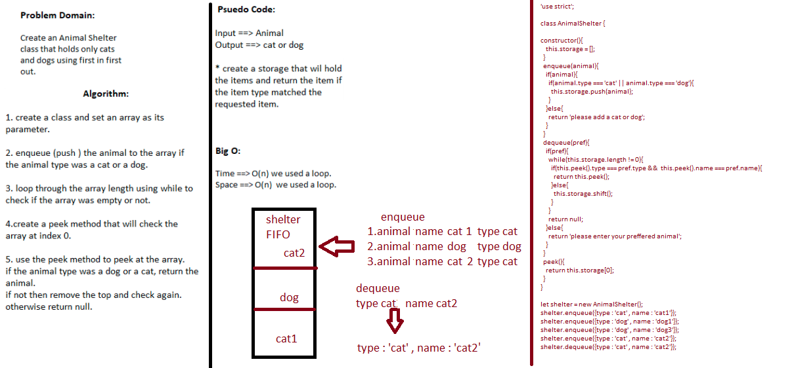

## Challenge
 - Create a Animal Shelter class to initiate queue using the following methods:
    1. enqueue()
    2. dequeue()
## Approach & Efficiency
 - Create a queue class & implement the required methods.
## Big O
 - enqueue () time ==> O(1) we did not use loops space ==> O(1) we did not use loops

 - dequeue () time ==> O(n) we used a loop space ==> O(n) we used a loop

## Solution
