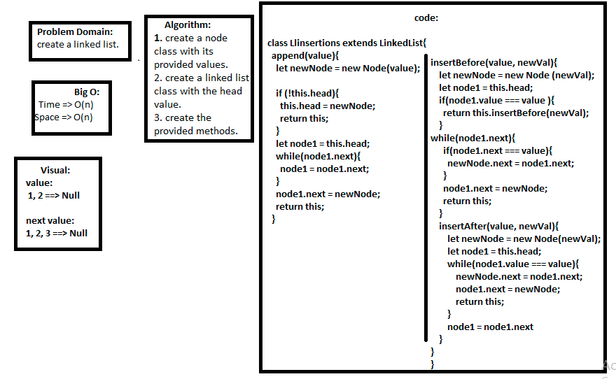

## Linked-List
 - create a linked list.
## Challenge
 - Create a Node class that has properties for the value stored in the Node, and a pointer to the next Node.
 - Within your LinkedList class, put append, insert before, insert after methods.
## Approach & Efficiency
 - creating 2 classes and inputing the methods through them.
## Big O
 - append method: Time ==> O(n) 
 - insert before method: Time ==> O(n) 
 - insert after method: Time ==> O(n)

## Solution
 