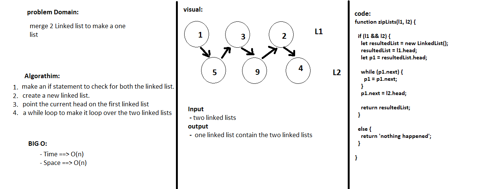

## Linked-List
 - create a merged Linked list.
## Challenge
 - Create a Node class that has properties for the two linked lists.
 - loop through boht linked lists finding the correct order.
##  Approach & Efficiency
 - creating 2 linked lists and merging them together.
## Big O
 - Time ==> **O(n)** 
 - Space ==> **O(n)**
## Solution
