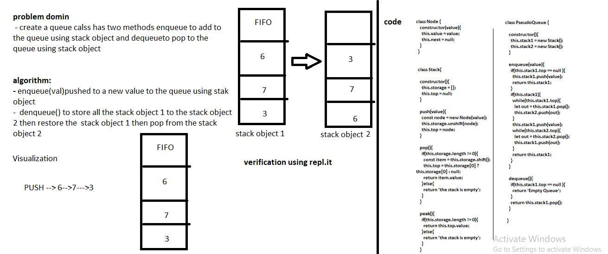

## Challenge
 - Create a brand new PseudoQueue class. Do not use an existing Queue. Instead, this PseudoQueue class will implement our standard queue interface (the two methods listed below), but will internally only utilize 2 Stack objects. Ensure that you create your class with the following methods:

   - enqueue(value) which inserts value into the PseudoQueue, using a first-in, first-out approach.
   - dequeue() which extracts a value from the PseudoQueue, using a first-in, first-out approach. The Stack instances have only push, pop, and peek methods. You should use your own Stack implementation. Instantiate these Stack objects in your PseudoQueue constructor. 
## Approach & Efficiency
 - enqueue(value) pushed anew value to the queue using the stack object here when i pop any item it will pop the first item that i pushed to the queue
 - dequeue() store all the stack1 items in the stack2 then restore the stack1 its values then pop from stack2
## the Big O 
 - enqueue(value)
    1. time: Big O Of(1)
    2.space: Big O Of(1)
- dequeue()
    1. time: Big O Of(n)
    2. space: Big O Of(1)
## Solution
