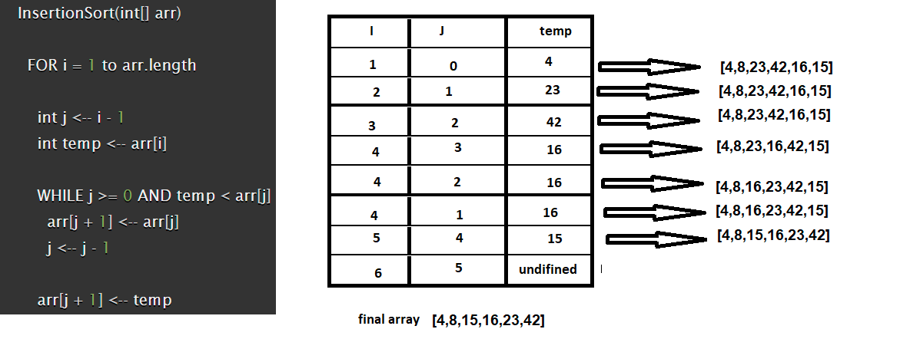

# Selection Sort

## Challenge
Selection Sort is a sorting algorithm that traverses the array multiple times as it slowly builds out the sorting sequence. The traversal keeps track of the minimum value and places it in the front of the array which should be incrementally sorted.
## Approach & Efficiency

1. loop throw the array elements and start from index 1 
2. store the index - 1 value in a variable called j
3. store the arr of current index value
4. loop using while if j>0 and current value is smaller than the previous value 
5. move the current index of j on step forward until while loop breaks  

6. the next value of j eauals the temp value 
### the Big O is Big O Of(n)
- **time**: Big O Of(n2) because we used insted loop
- **space**: Big O Of(2)  because we used insted loop   

## Input/Output
 1. **Input**: array
 2. **Output**: sorted array    

 ----

