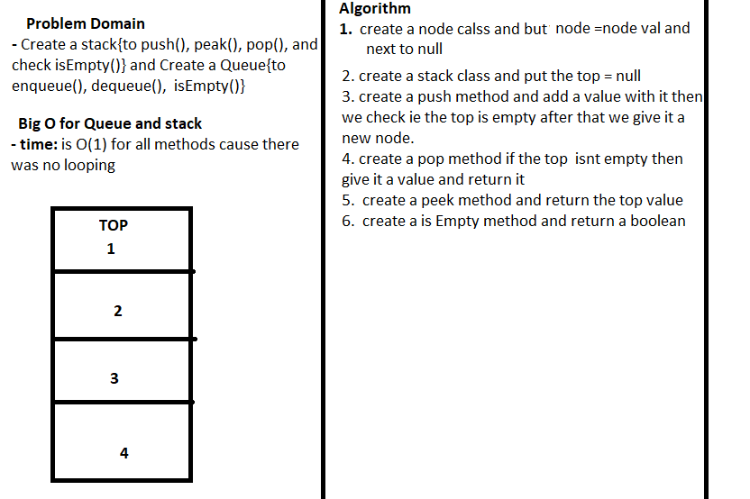

## Stacks-and-Queues
 - create a stacks and a queueu class.
## Challenge
 - classes that have methods put, pop, push, peek, isEmpty.

## Approach & Efficiency
 - I used classes
## Input and Output
 -  **Input** : value 
 - **Output** : stack or queue 
 -  For the **is(Empty)**:
    -  **Input** : stack or queue 
    - **Output** : boolean
## BIG O for all mathods    
 - time ==> O(1)   
 - Space ==> O(1) 
 ## Visual:
 ### STACKS
 1. **push**
    - [1] =>[2] =>[3] =>Null push(4) [1] =>[2] =>[3] =>[4] => Null
 2. **pop**
    - [1] =>[2] =>[3] =>Null pop() [1] =>[2]  Null
 3. **is(Empty)**:
    - [1] =>[2] =>[3] =>Null isEmpyt() => false
    - Null isEmpyt() => true
### QUEUE
 1. **enqueue**
    - [1] =>[2] =>[3] =>Null enqueue(4) [1] =>[2] =>[3] =>[4] => Null
 2. **pop**
    - [1] =>[2] =>[3] =>Null dequeue() [1] =>[2]  Null
 3. **is(Empty)**:
    - [1] =>[2] =>[3] =>Null isEmpyt() => false
    - Null isEmpyt() => true

## Solution
