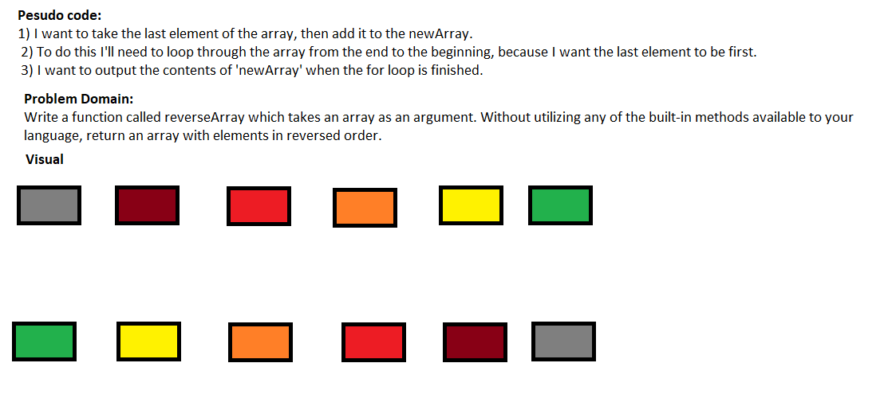

# data-structures-and-algorithms
# Code 401d4 challenges
## Description
- This web site is about challenges that in ***401d4*** and I will put them in the table of contant below:
## Table of contant:
**challenges**  | **Links**
  -------------  | -------------
  *arrayReverse* | [link](https://hussein-401-advanced-javascript.github.io/data-structures-and-algorithms/)
  
  -----------------------------------------------
  # Reverse an Array
- In the **Code Challenge: Class 01**(Reverse an Array) I will put a Function to handle an Array ***-Regardless of size and type of the array-***
and I will **reverse** without utilizing any of the **built-in methods**
## Challenge
- Write a function called reverseArray which takes an array as an argument. Without utilizing any of the built-in methods available to your language, return an array with elements in reversed order.
## Approach & Efficiency
- This Code Challenge is easy and took me around 10 min.

## Solution
