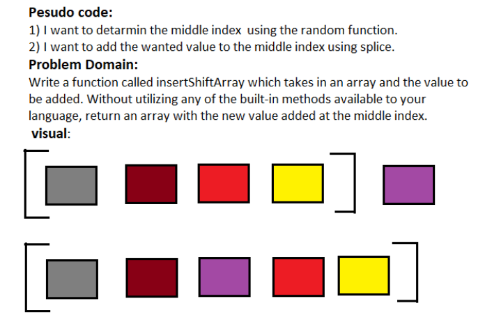

# ShiftArray
- In the **Code Challenge: Class 02**(ShiftArray) I will put a Function to handle an Array ***-Regardless of size and type of the array-***
and I will **Shift the new value added at the middle index** without utilizing any of the **built-in methods**
## Challenge
- Write a function called insertShiftArray which takes in an array and the value to be added. Without utilizing any of the built-in methods available to your language, return an array with the new value added at the middle index.
## Approach & Efficiency
- This Code Challenge is some how easy and took me around 30 min.
