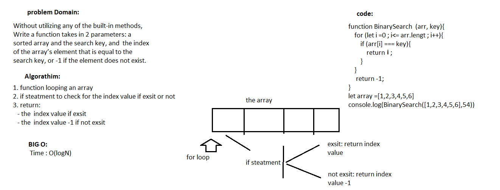

##  Challenge Summary
 Write a function called BinarySearch which takes in 2 parameters: a sorted array and the search key. Without utilizing any of the built-in methods available to your language, return the index of the array’s element that is equal to the search key, or -1 if the element does not exist.
## Challenge Description
 to Write a function to serch for index value in array wihout using bulid in methods
## Approach & Efficiency
the function will use a for loop and if steatment
## Solution
