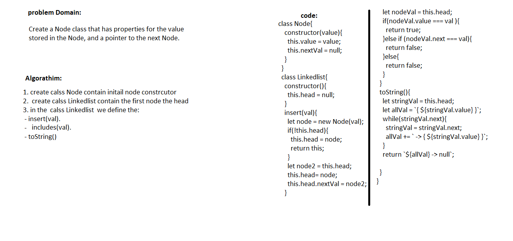

## Reverse an Array
- In the **Code Challenge: Class 05**(Linked List) I will Create a Node class that has properties for the value stored in the Node, and a pointer to the next Node. 
## Challenge
-Create a Node class that has properties for the value stored in the Node, and a pointer to the next Node.
Within your LinkedList class, include a head property. Upon instantiation, an empty Linked List should be created.
## Approach & Efficiency
-  using classes and method inside it to (insert/includes/toString) a linked list withe nodes 
## Solution
